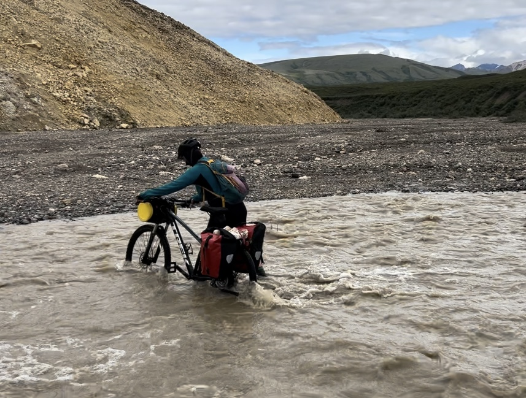

# Hello!

## Navigating This Portfolio
Thanks for taking the time to look over my portfolio! I've organized my experience by category into the directories listed above. Clicking into a directory will load images and descriptions of highlighted projects for each category. You can also find a PDF of my resume in the directory above.Please don't hesitate to reach out with any questions or clarification.

## About Me
Driven by a passion for leveraging geospatial technologies and data science to solve complex challenges. With a strong foundation in Geographic Information Systems and ongoing studies in Computer Science, I bring a unique blend of analytical skills and technical expertise to every project.
I'm currently on the Environmental Informatics team at the San Francisco Estuary Institute, where I mostly work applying machine learning algorithms to large-scale mapping projects. Experienced in Python, JavaScript, and SQL, with a proven track record in project management and cross-functional collaboration.
Committed to transforming raw data into actionable insights, bridging the gap between technical analysis and practical decision-making across various industries.

In my free time, I love mountain biking, creative writing, reading, and sewing! I currently live in the Outer Sunset in San Francisco, CA, which is the best city in the world in my opinion. I'm always looking for new burmese food or book recommendations!
  