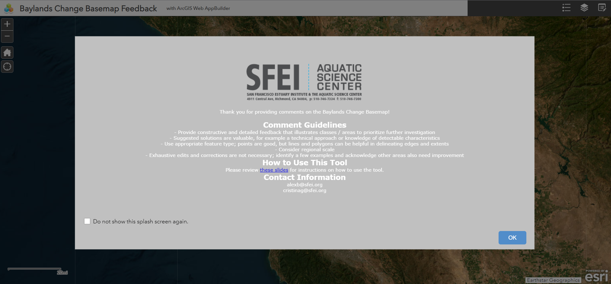
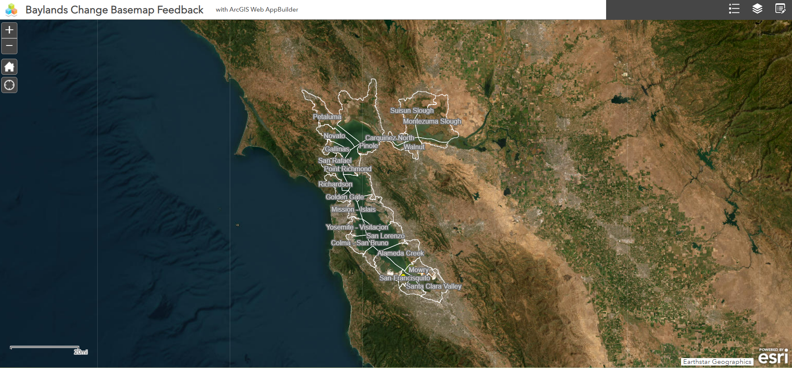
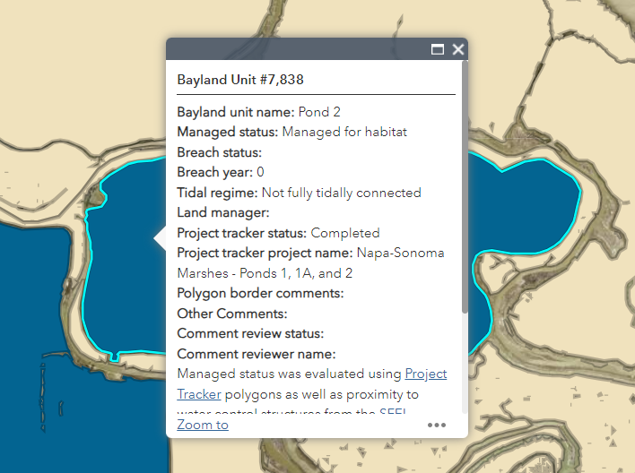
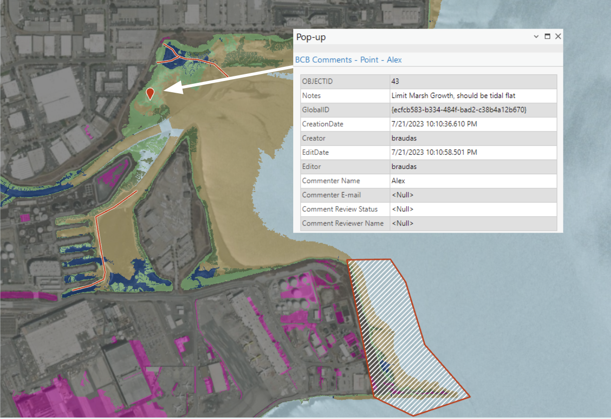

# ArcGIS Online (AGOL) Projects

### The Baylands Habitat Map Feedback Tools
 
 

- **Description**: I developed these ArcGIS Online WebApps to support the [Baylands Habitat Map 2020](https://www.sfei.org/projects/baylands-change-basemap), a mapping effort by SFEI to comprehensively catalog the bayland habitats surrounding the San Francisco Bay. This was a highly anticipated project with a wide breadth of stakeholders and participants from whom we were required to gather feedback. As a solution, I developed a pair of AGOL WebApps, which allowed users to view draft iterations of the Baylands Habitat Map and provide comments in the form of points, lines, and polygons or to edit the attributes of polygons directly. To avoid redundant efforts, once a bayland unit was reviewed, AGOL was set up so that the unit would "disappear" from the map. Additionally, comments changed symbology once the feedback was addressed so that users were able to check the status of their input.
- **Skills Used**: ArcGIS Pro, ArcGIS Web AppBuilder. ArcGIS Online

## Housekeeping
- Email: regan.murray714@gmail.com

Each of the image files referenced above is available in the img_files folder within this directory. Please take a look and feel free to reach out if you have any questions or would like to collaborate!
