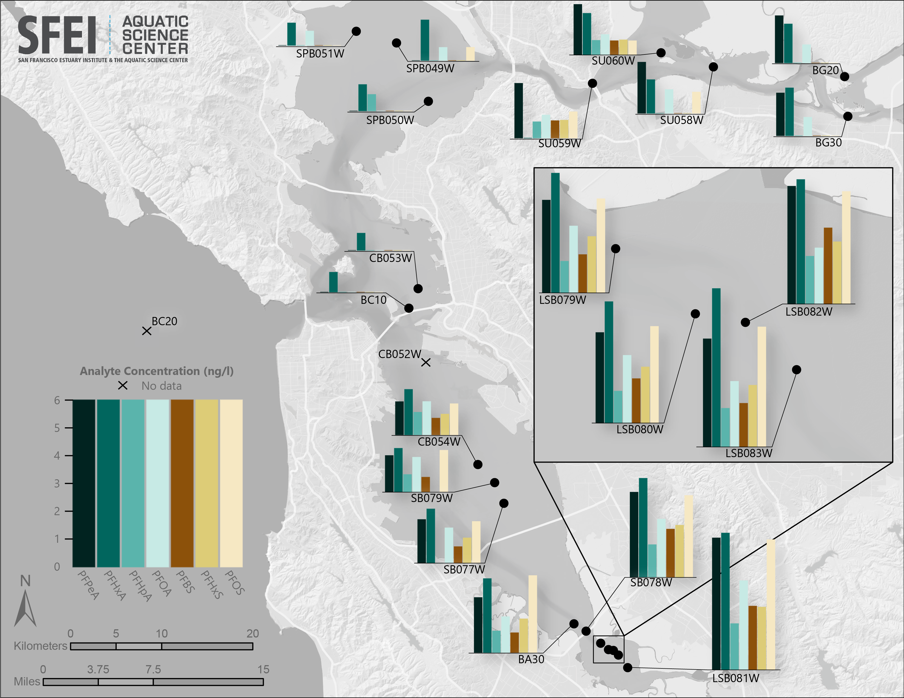
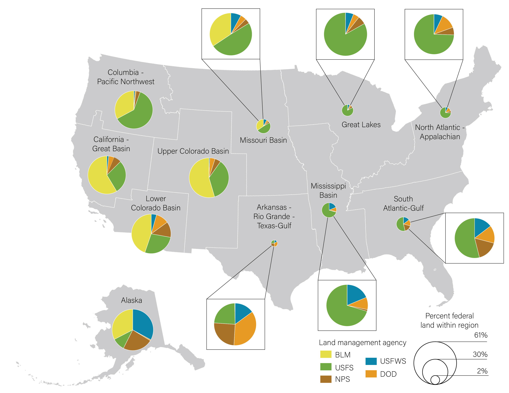

# Cartography Projects

### Impacts of the Pandemic on National Park Visitation

- **Description**: This poster was the final output of a personal interest project in which I analyzed data from the National Park Service (NPS) on visitation. I used Python to automate extracting the visitation numbers from the NPS data clearinghouse and to generate all of the charts, including the bar charts and each individual park's line chart of visitation. ArcGIS Pro was used to create each of the individual maps. The charts and maps were modified slightly in Adobe Illustrator before being incorporated into the poster layout in InDesign.
- **Skills Used**: ArcGIS Pro, Adobe Illustrator, Adobe InDesign, Python

### Conaminants in the San Francisco Bay

- **Description**: This is a map I created at SFEI on a short timeline to support a Clean Water report on contaminants in the San Francisco Bay. The Clean Water team needed a single map that showed the quantity of seven separate contaminants at each of their sampling sites across the bay. I used a CVD-appropriate palette from ColorBrewer to create a map of the sampling points in ArcGIS Pro. Then, I used Python to automatically generate SVG elements of a bar chart for each site. Finally, I used illustrator to attach the bar chart elements to the map.
- **Skills Used**: ArcGIS Pro, Adobe Illustrator, Python

### Monterey Bay Aquarium Seafood Watch Poster
 

- **Description**: This poster was the final output of a personal interest project in which I analyzed data from NOAA Fisheries to create a flow map for a pair of posters. Python was used to extract and analyze the data, and I create the final map in ArcGIS Pro. Adobe Illustrator and InDesign were used to modify the design further and lay out the final two posters.
- **Skills Used**: ArcGIS Pro, Adobe Illustrator, Adobe InDesign, Python

### Democratic Republic of the Congo Terrain Map

- **Description**: This was a quick map I developed as a passion project in honor of my favorite book of all time, The Poisonwood Bible by Barbara Kingsolver! I followed the extremely useful tutorias Daniel Huffman posted on their [blog](https://somethingaboutmaps.wordpress.com/) to generate shaded relief and hypsometric tints. Because this map was going to be of an entire country, I used a low-resolution DEM downloaded from Viewfinder Panoramas. Photoshop was used to blend the hypsometric tint and hydrography layers into the shaded relief I developed in Blender. Although processing intensive, this was quite a fun project that helped bring my favorite book to life for me!
- **Skills Used**: Blender, Adobe Photoshop, Adobe Illustrator

### DOI Land Management Agency by DOI Region

- **Description**: This was a quick map I developed to support an effort to determine how funding from the various Department of Interior (DOI) agencies should be distributed to restoration/ land management projects by DOI region. I ended up performing a quick analysis of the area managed by each DOI agency within each DOI region, then created this graphic as a visual companion to the final tabular dataset. The size of the circles represent what proportion of all federal land falls within each DOI region, and the colors within each pie chart represents the respective DOI agencies that had contributed funds. 
- **Skills Used**: ArcGIS Pro, Excel, Adobe Illustrator

## Housekeeping
- Email: regan.murray714@gmail.com

Each of the image files referenced above is available in the img_files folder within this directory. Please take a look and feel free to reach out if you have any questions or would like to collaborate!
