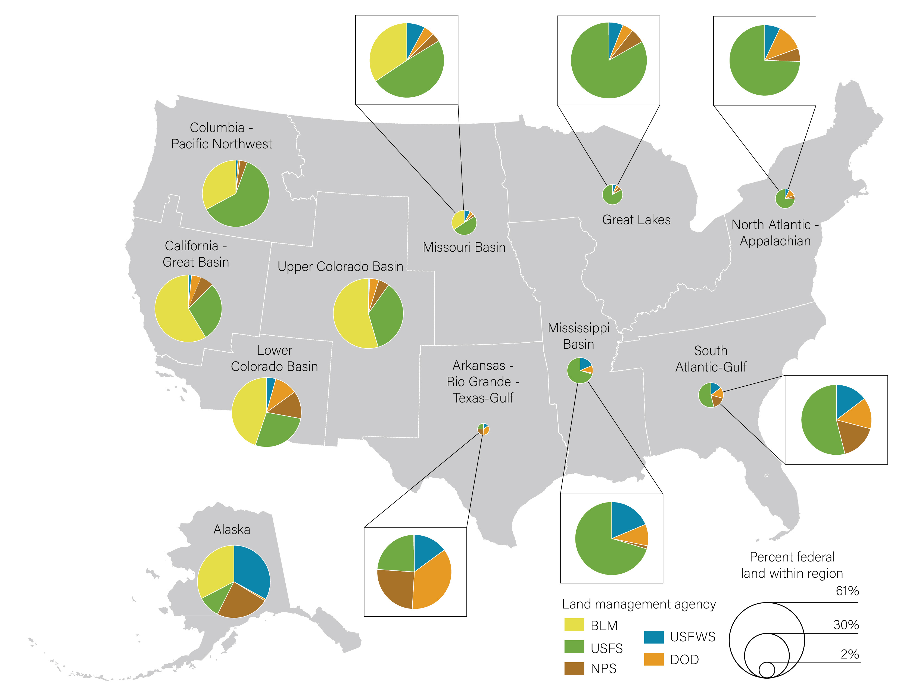

# Cartography Projects

### Impacts of the Pandemic on National Park Visitation

- **Description**: This poster was the final output of a personal interest project in which I analyzed data from the National Park Service (NPS) on visitation. I used Python to automate extracting the visitation numbers from the NPS data clearinghouse and to generate all of the charts, including the bar charts and each individual park's line chart of visitation. ArcGIS Pro was used to create each of the individual maps. The charts and maps were modified slightly in Adobe Illustrator before being incorporated into the poster layout in InDesign.
- **Skills Used**: ArcGIS Pro, Excel, Adobe Illustrator, Adobe InDesign, Python

### Monterey Bay Aquarium Seafood Watch Poster
 

- **Description**: This poster was the final output of a personal interest project in which I analyzed data from the National Park Service (NPS) on visitation. I used Python to automate extracting the visitation numbers from the NPS data clearinghouse and to generate all of the charts, including the bar charts and each individual park's line chart of visitation. ArcGIS Pro was used to create each of the individual maps. The charts and maps were modified slightly in Adobe Illustrator before being incorporated into the poster layout in InDesign.
- **Skills Used**: ArcGIS Pro, Excel, Adobe Illustrator, Adobe InDesign, Python

### DOI Land Management Agency by DOI Region

- **Description**: This was a quick map I developed to support an effort to determine how funding from the various Department of Interior (DOI) agencies should be distributed to restoration/ land management projects by DOI region. I ended up performing a quick analysis of the area managed by each DOI agency within each DOI region, then created this graphic as a visual companion to the final tabular dataset. The size of the circles represent what proportion of all federal land falls within each DOI region, and the colors within each pie chart represents the respective DOI agencies that had contributed funds. 
- **Skills Used**: ArcGIS Pro, Excel, Adobe Illustrator

## Contact Information
- Email: regan.murray714@gmail.com
Feel free to reach out if you have any questions or would like to collaborate!
