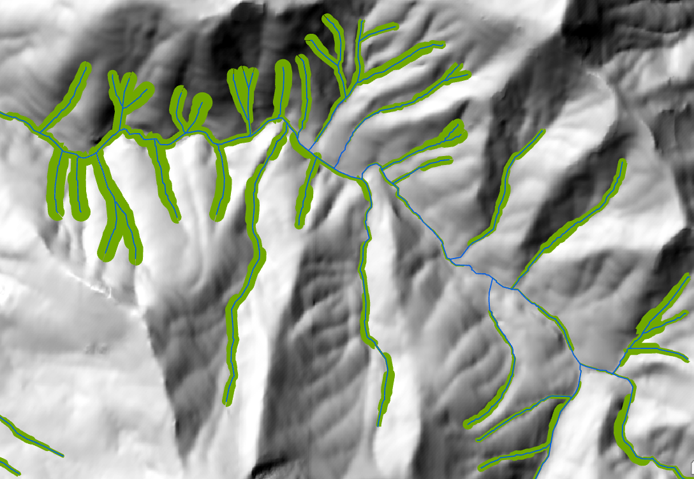

# Geospatial Analysis Projects

### San Francisco Bayland Units

- **Description**: This dataset was produced as a supplementary product for the [Baylands Habitat Map 2020](https://www.sfei.org/projects/baylands-change-basemap) project. The Bayland Units are cohesive marsh units, determined by ecology and management, across the San Francisco baylands. I developed a python script to attribute these baylands with the necessary fields, including tidal regime, management status, and restoration project status. As part of the script, I developed a function which employs a decision tree to attribute a target polygon. The script prioritizes (1) recency, (2) largest percent overlap between various overlapping polygons, making note to disregard more recent data if the percent overlap was below a certain threshold. I developed the percent overlap functionality as part of this script as well.
- **Skills Used**: ArcGIS Pro, Python

### Seeds of Success (SOS) Gap Analysis
 

- **Description**: One of the primary functions of the Bureau of Land Management's (BLM) native plant program is to collect and produce native seed for restoration purposes. Each year, hundreds of collectors set out across the entire United States to make thousands of seed collections, which are in turn used for farming more seed, research, or directly for restoration. A gap analysis is performed each year to direct funding, hiring, and effort across each state. To perform the gap analysis, I used Python to perform zonal statistics of the collection data by both Seed Transfer Zone (PSTZ) and species. Then, I used pyplot and matplotlib to produce svg elements of maps showing the number of seed collections per species per seed transfer zone. Eventually, these maps and analyses are compiled into a 50+ page report that is distributed across the states to support planning.
- **Skills Used**: ArcGIS Pro, Python, Adobe Illustrator, Adobe InDesign

### Riparian Zones Estimation Tool (RipZet)

- **Description**: This project was done in collaboration with Caltrans. RipZet is a tool developed by the San Francisco Estuary Institute to estimate functional riparian areas around streams and wetlands. Caltrans requested we provide them with a RipZet output for the entire state of California. Historically this tool only had implementation in Python 2.7 and ArcMap, and was extremely time-consuming and computationally intensive. For this project, I (1) updated the tool to Python 3.12, (2) improved the efficiency of processing with the Esri Geoanalytics toolbox, Pairwise functionality, and parallel processing environmental settings, (3) used Python to automatically generate inputs for the tool by HUC12 for the entire state of California, (4) used Python to iteratively run the tool across the entire state of California. For the data inputs, I leveraged CalVeg polygons, a state-wide 5m resolution Canopy Height Model (CHM), and zonal statistics to get more accurate vegetation height information for the model. Ultimately I was able to deliver on a statewide vector dataset of functional riparian areas for both wetlands and streamlines. 
- **Skills Used**: ArcGIS Pro, Python

## Housekeeping
- Email: regan.murray714@gmail.com

Each of the image files referenced above is available in the img_files folder within this directory. Please take a look and feel free to reach out if you have any questions or would like to collaborate!
