# Automated Mapping Projects

### San Diego Aquatic Resource Inventory (SDARI)
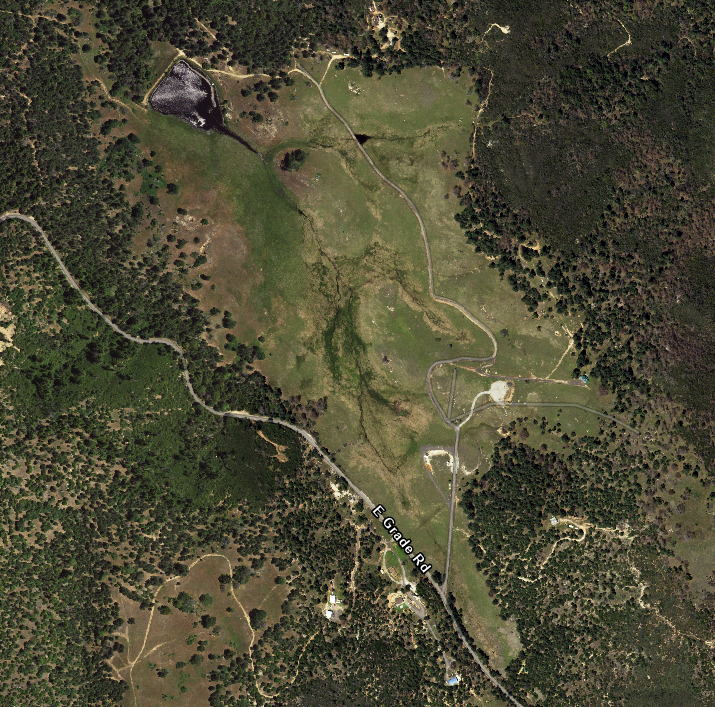 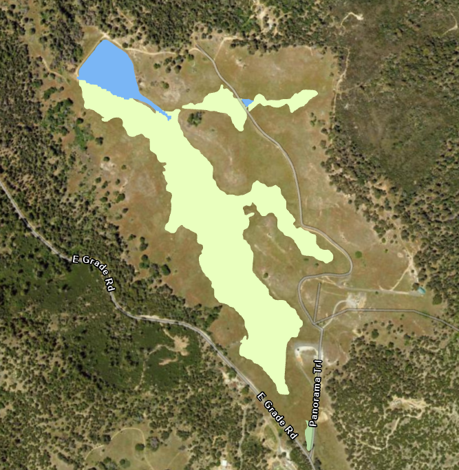
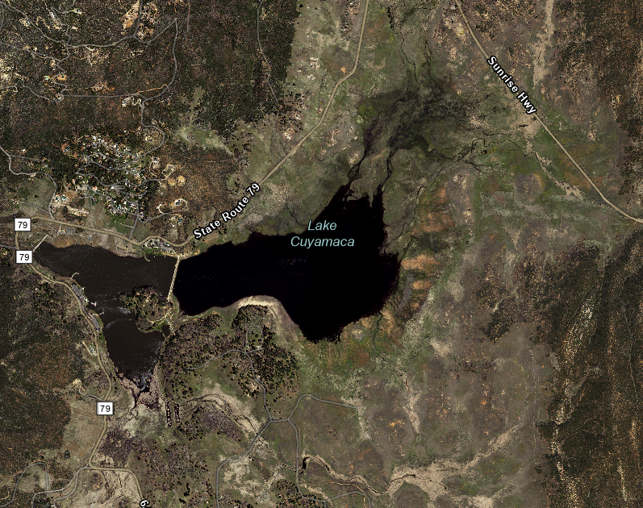 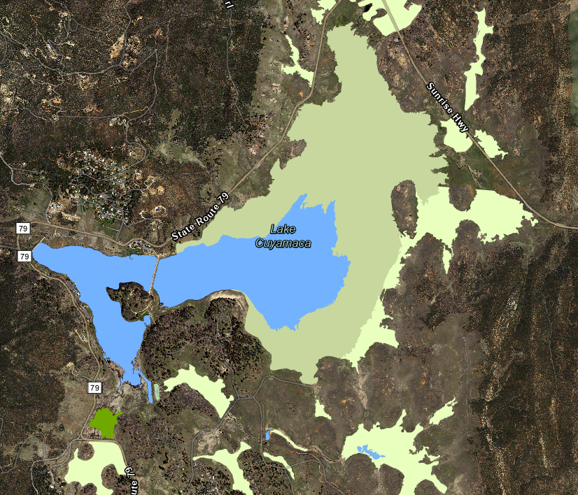
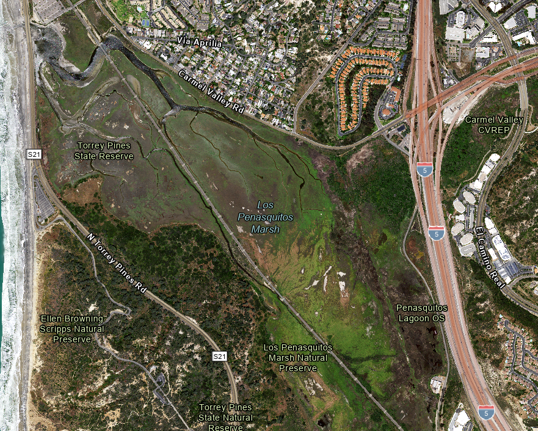 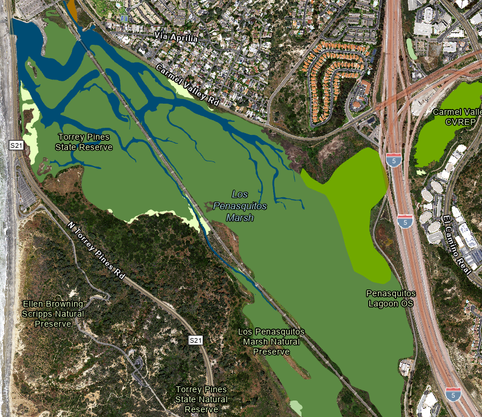

- **Description**: This dataset was developed by SFEI in collaboration with the California Water Quality Control Board. The San Diego Aquatic Resource Inventory (SDARI) is a comprehensive map of wetland habitats in the 2.5 million acre area within the California Qater Quality Control Board region 9. This product was generated by using an object-based Support Vector Machine algorithm to generate an initial classificaiton, then refined using thresholding. The primary inputs to this model included imagery (NAIP 2020 and a time-series Sentinel-2 Principal Components Analysis), lidar derivatives (geomorphons, fill difference, flow accumulation, terrain ruggedness index, slope, local relief model, etc.), and object shape and relationship properties. The final output boasted an accuracy of 84%.
- **Impact**: This work was incorporated into the [California Aquatic Resource Inventory](https://www.sfei.org/cari) and led to further funding for SFEI to explore machine learning for automated wetland mapping. The efforts from this project are being repeated and improved upon in a new project mapping wetlands in the Russian River watershed.
- **Skills Used**: ArcGIS Pro, Python, Google Earth Engine, eCognition

### Mapping Individual Vernal Pools in California's Central Valley
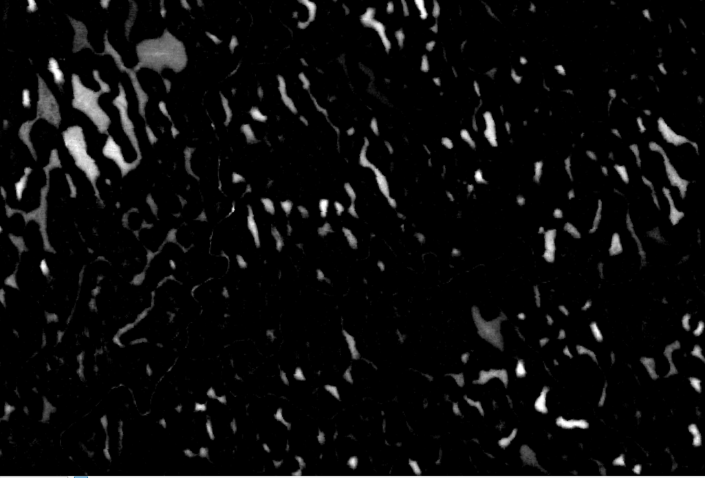 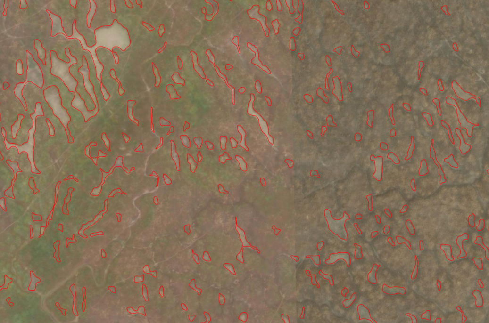
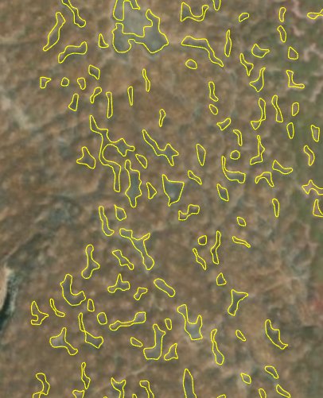 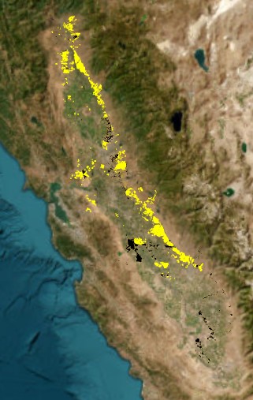

- **Description**: In collaboration with Caltrans, I leveraged an object-based random forest algorithm to delineate and classify individual vernal pools across the central valley of California. I used the vernal pool complex polygons developed by Carol Witham as a study area. The model inputs included high resolution lidar (seamlessly mosaicked and resampled to 1m resolution) and 2020 NAIP imagery (60 cm resolution). Fill difference was derived from the high resolution lidar to create a raster layer of small depressions. With the help of a regional wetland expert, I created 1200+ training points across the entire study area, which I used to train a random forest algorithm. Superpixel segmentation was used on the Fill Difference raster to create depression objects, which were then classified using the trained random forest model. This initial mapping project has lead to projects further developing the methods. Currently, I am working on incorporating high resolution time-series imagery from Planet into the model. See the project page [here](https://www.sfei.org/data/sfei-individual-vernal-pools-2023#sthash.0FYT4GTv.dpbs).
- **Impact**: This work was incorporated into the [California Aquatic Resource Inventory](https://www.sfei.org/cari) and gained recognition and attention from several organizaitons, notably the Environmental Protection Agency (EPA). This project sparked an ongoing collaboration between SFEI and the EPA, and was used as leverage for the institute to gain access to typically costly Planet imagery.
- **Skills Used**: ArcGIS Pro, Python, Google Earth Engine, eCognition

### Contaminents of Emerging Concern (In Progress)
 
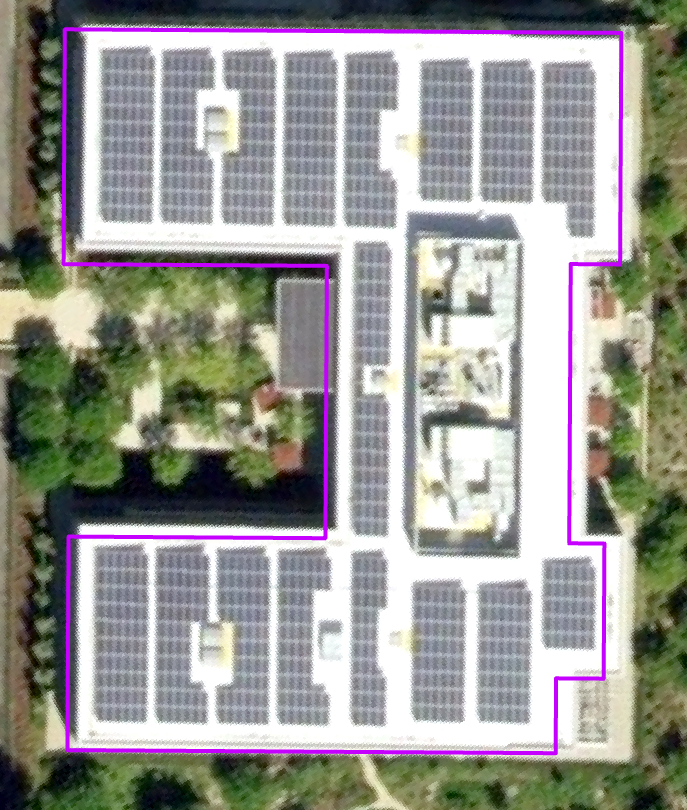 
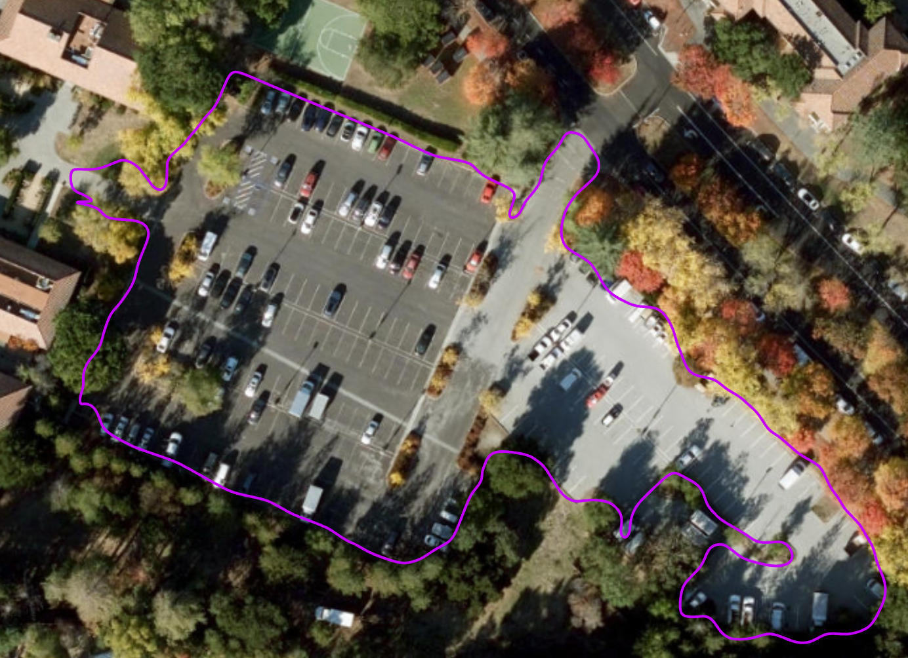 
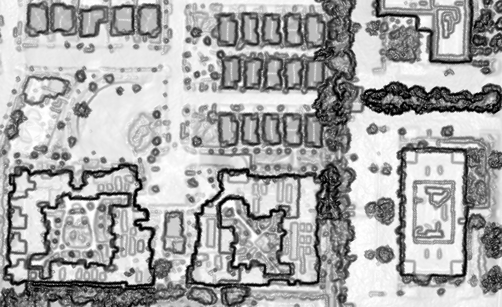 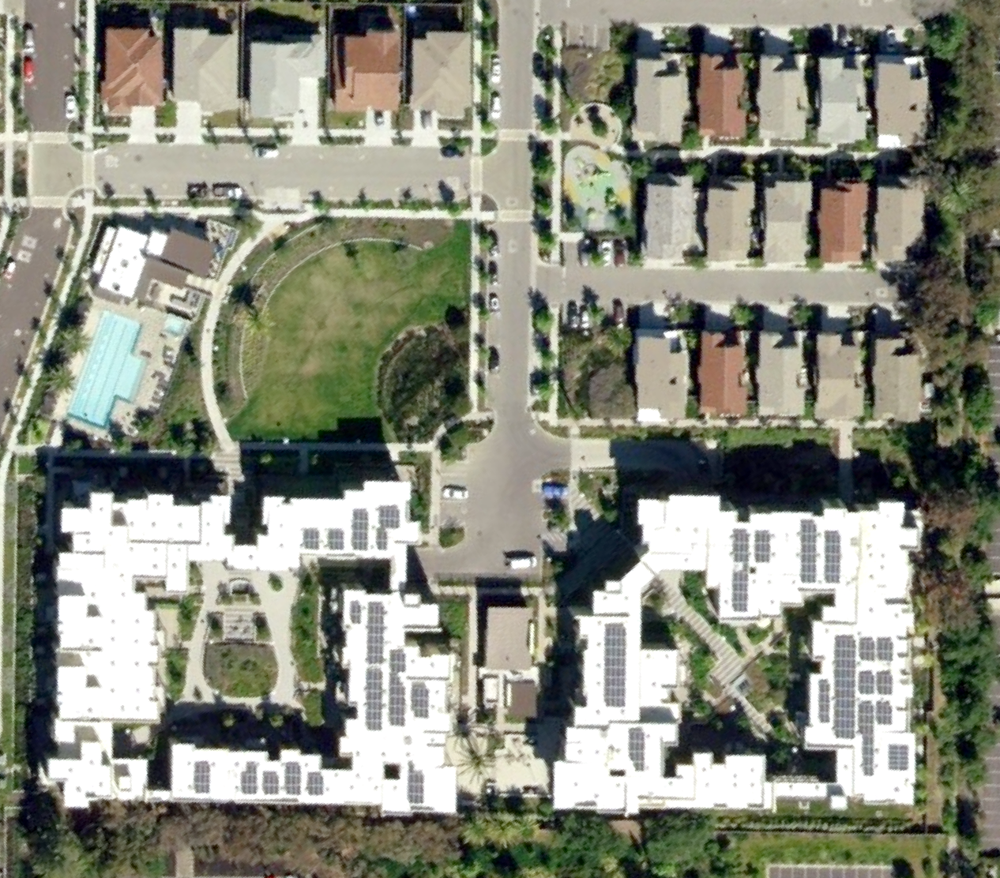 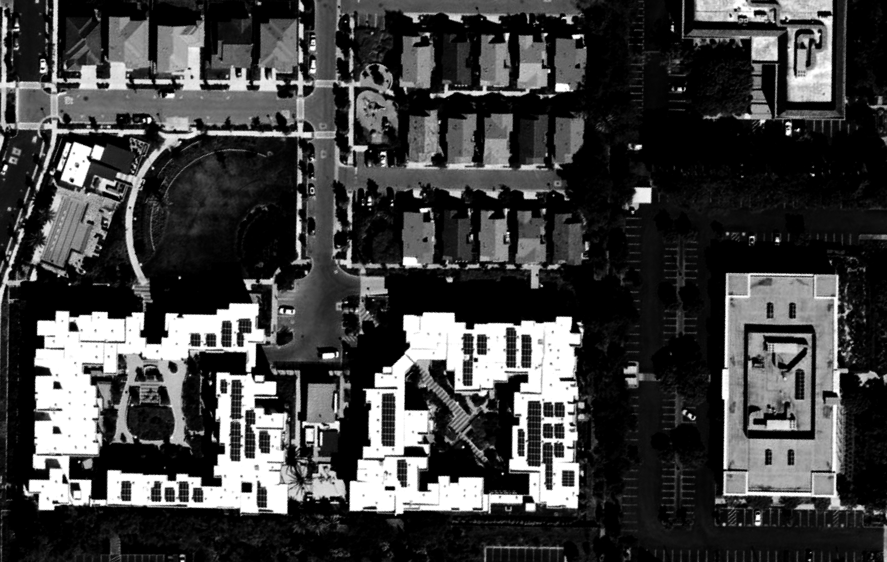
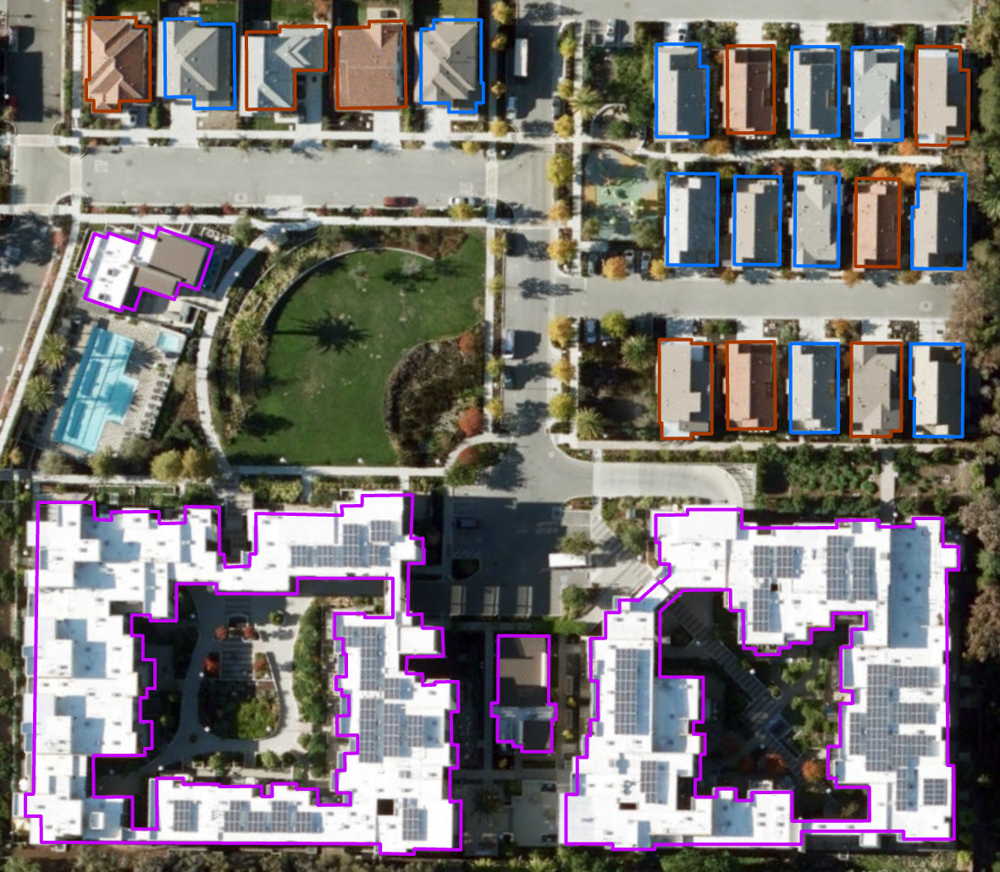

- **Description**: In collaboration with the Clean Water program at SFEI, I have been developing methods for using remote sensing to estimate toxins in water for the Contaminents of Emerging Concern (CEC) project. Target classes for this project include artifical turf, solar panels, parking lots, roadways, and roofing material. The outputs for this project were generated using both a Convolutional Neural Network (CNN) and Support Vector Machine (SVM). Inputs include high resolution imagery (30cm NAIP 2020) and lidar (1m resolution 3DEP 2020).
- **Impact**: This work is in progress.
- **Skills Used**: ArcGIS Pro, Python, eCognition

## Housekeeping
- Email: regan.murray714@gmail.com

Each of the image files referenced above is available in the img_files folder within this directory. Please take a look and feel free to reach out if you have any questions or would like to collaborate!
