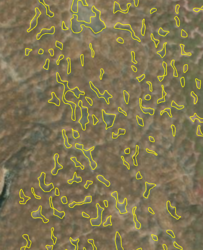

# ArcGIS Online (AGOL) Projects

### Mapping Individual Vernal Pools in California's Central Valley
 
 

- **Description**: In collaboration with Caltrans, I leveraged an object-based random forest algorithm to delineate and classify individual vernal pools across the central valley of California. I used the vernal pool complex polygons developed by Carol Witham as a study area. The model inputs included high resolution lidar (seamlessly mosaicked and resampled to 1m resolution) and 2020 NAIP imagery (60 cm resolution). Fill difference was derived from the high resolution lidar to create a raster layer of small depressions. With the help of a regional wetland expert, I created 1200+ training points across the entire study area, which I used to train a random forest algorithm. Superpixel segmentation was used on the Fill Difference raster to create depression objects, which were then classified using the trained random forest model. This initial mapping project has lead to projects further developing the methods. Currently, I am working on incorporating high resolution time-series imagery from Planet into the model. See the project page [here](https://www.sfei.org/data/sfei-individual-vernal-pools-2023#sthash.0FYT4GTv.dpbs).
- **Impact**: This work was incorporated into the [California Aquatic Resource Inventory](https://www.sfei.org/cari) and gained recognition and attention from several organizaitons, notably the Environmental Protection Agency (EPA). This project sparked an ongoing collaboration between SFEI and the EPA, and was used as leverage for the institute to gain access to typically costly Planet imagery.
- **Skills Used**: ArcGIS Pro, Python, Google Earth Engine, eCognition

## Housekeeping
- Email: regan.murray714@gmail.com

Each of the image files referenced above is available in the img_files folder within this directory. Please take a look and feel free to reach out if you have any questions or would like to collaborate!
